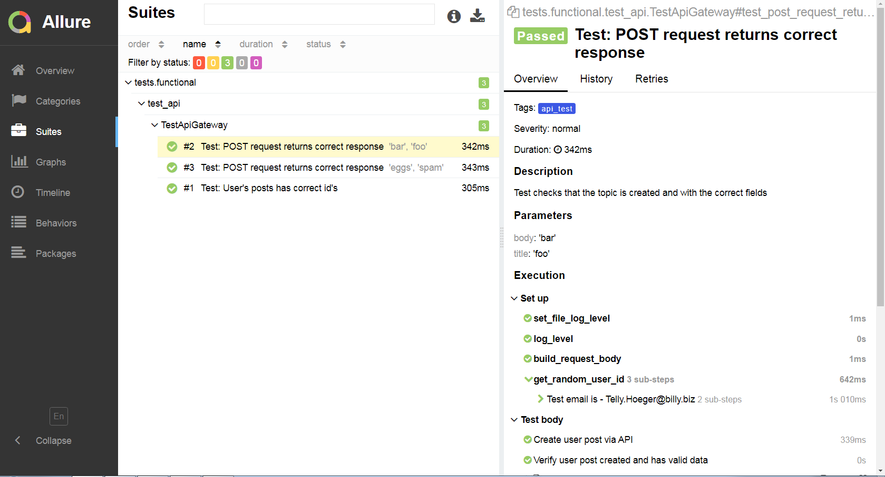
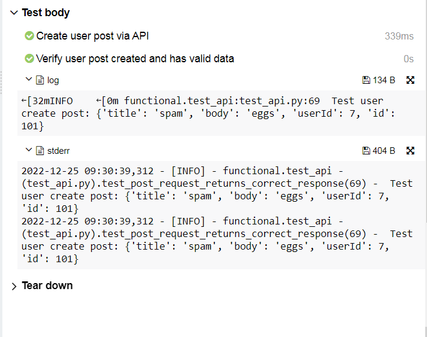

# qa_365

Project contains functional tests for API, Web e2e, DB, CSV data reading test:
qa_365/tests/functional/test_api.py -- api tests with logs examples and allure reporting BDD example
qa_365/tests/functional/test_e2e.py -- selenium web test
qa_365/tests/functional/test_db.py -- simple test for db connect check
qa_365/tests/functional/test_scv_data.py  -- api test uses csv_file to get and assert api request
qa_365/tests/functional/test_mock.py -- simple mock test with Flask

qa_365/common  --  helpers for tests 
qa_365/data --  test data files

### How to install project:
1. Make 'git clone' project 
2. cd to the directory with requirements.txt
3. activate your virtualenv
4. install requirements
```
git clone https://github.com/alekseyby/qa_365.git
cd qa_356
python -m venv <directory>
python -m venv venv
pip install -r requirements.txt
```
### Hot to run tests:
Default run for all test, supports all default pytest flags, eg -m that allows to run "tagged" test.
This project contains tests marked as "e2e_test", "api_test", "db_test", "mock_test"
```
pytest -l -m api_test
```
will run only api tests
### Custom run tests option:
```
--browser_type  | Allow to run test for Chrome and Firefox, default settings - "Chrome"
--headless | Allow to run test in 'headless' mode, default settings - True
--file_log_level | Sets log level to write logs to files. default setting  - 'WARNING'. See "Logging" part below
```

### Run example:
Will run tests in 'n' parallel threads, only tests marked as 'api_test', will write all logs above level 'INFO',
headless mode OFF, browser Chrome
```
pytest -l -n auto -m api_test --file_log_level INFO --headless False --browser_type Chrome 
```

### Run in parallel with pytest xdist plugin:
```
pytest -n auto | With this call, pytest will spawn a number of workers processes equal to the number of available CPUs,
and distribute the tests randomly across them. 
```
for more information please check xdist project documentation

### Logging:
Project contains 'log_helper' which allows you to change the level of logging that will be logged to files.
For example, if you set the DEBUG level, all messages will go to the log files.
If set ERROR, then only errors of the ERROR, CRITICAL level will get into the logs.
Log levels, from high to low:
```
CRITICAL
ERROR
WARNING
INFO
DEBUG
```
### DB connections
Module db_adapter.py allows to connect and read data as part of pre/post test conditions.
Please check test_db.py for usage example.
Take a note that for now it uses third party PostgresDB for module main functionality testing

### Reporting:
To create Allure report, eg. est_api.py:
```
pytest --alluredir=<path to report directory> test_api.py
allure serve <path to report directory>
```
#### We can see allure report with detailed steps



#### Logs and console outputs

